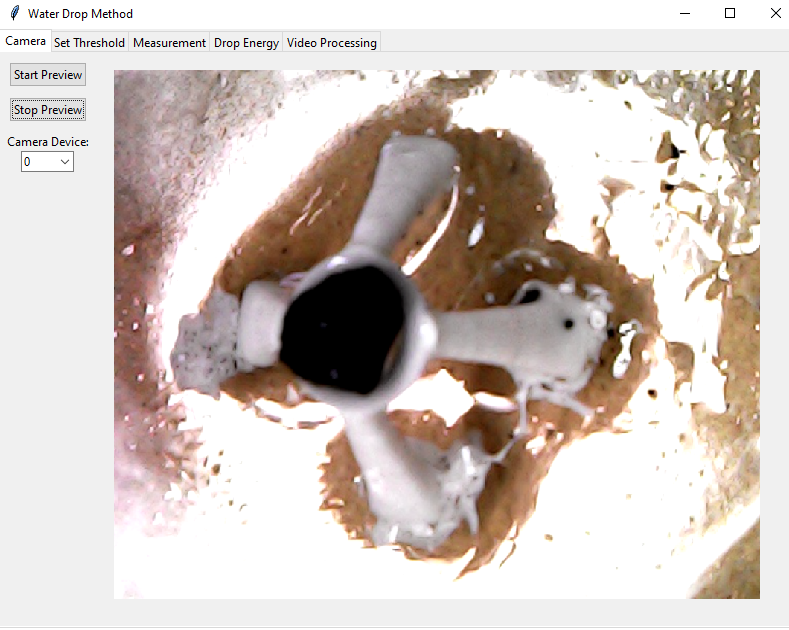
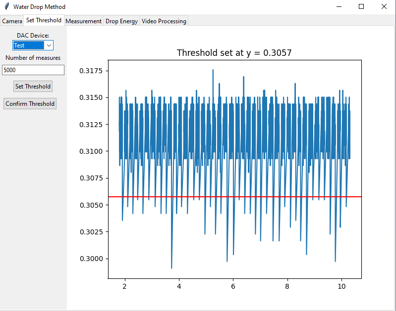
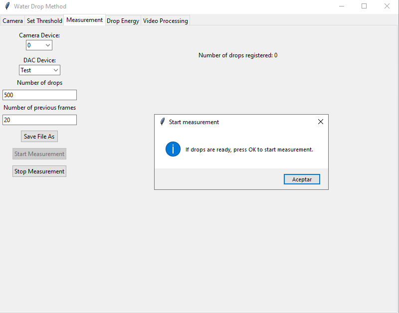
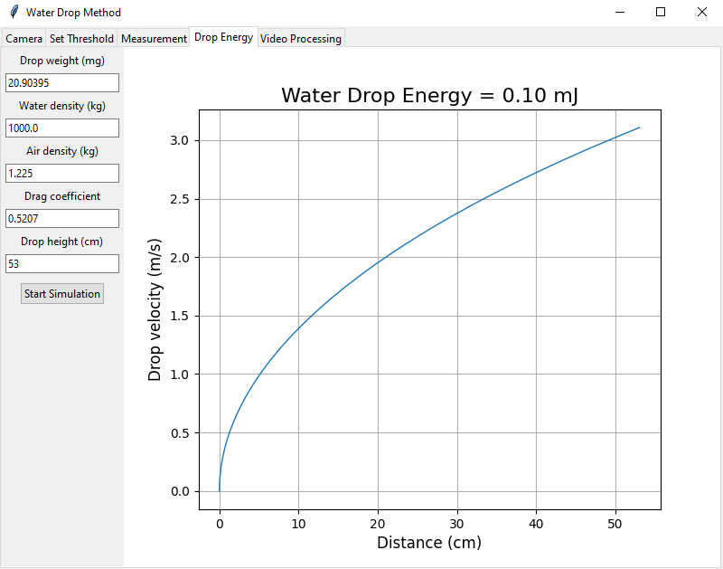
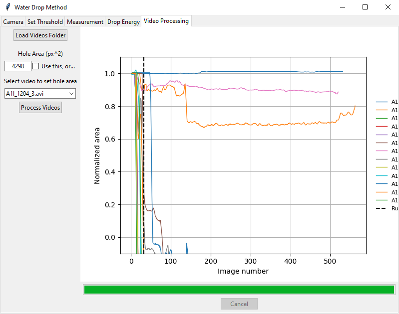

# Water Drop Method

Desktop app based on Tkinter to implement the Water Drop Method and determine the structural stability of soil aggregates.

## Distribution

The application is currently distributed as a compiled build for Windows 64-bit.

- GitHub Releases: https://github.com/alencina-faa/Water-drop-method/releases
- SourceForge: https://sourceforge.net/projects/water-drop-method/

## Highlights

- GUI workflow with tabs for camera preview, threshold setup, measurement, drop energy, and video processing.
- Runtime state persisted per user on Windows.
- Package-safe import structure for src-layout projects.
- Basic automated test suite with structural and persistence checks.

## Project Structure

- `src/Water_drop_method`: application package
- `tests`: automated tests
- `output`: local build artifacts (ignored by git)

## Requirements

- Python 3.10+
- Dependencies:
  - `pillow`
  - `numpy`
  - `matplotlib`

## Install (Editable)

```bash
python -m venv .venv
.venv\Scripts\activate
pip install -e .
```

## Run

```bash
python -m Water_drop_method
```

## Run Tests

```bash
pytest -q
```

## Tabs Guide

### Camera

Use this tab to preview the camera feed and validate framing before measurements.

- Select the camera device index.
- Click Start Preview to begin live visualization.
- Click Stop Preview to stop the stream.



### Set Threshold

Use this tab to compute and confirm the photodiode threshold.

- Select DAC device.
- Set the number of measures.
- Click Set Threshold and review the plotted signal and threshold line.
- Click Confirm Threshold to save it.



### Measurement

Use this tab to execute the drop measurement workflow.

- Select camera and DAC device.
- Set number of drops and previous frames.
- Choose output video path using Save File As.
- Start and stop acquisition with the corresponding buttons.



### Drop Energy

Use this tab to estimate drop velocity and energy from physical parameters.

- Configure drop weight, fluid density, air density, drag coefficient, and drop height.
- Click Start Simulation to generate the velocity vs distance curve.



### Video Processing

Use this tab to batch-process saved videos and analyze normalized area over frames.

- Load a folder containing videos.
- Define hole area manually or by selecting a reference video.
- Click Process Videos to run analysis and inspect output plots.



## Runtime State Files

The app stores runtime state in a per-user writable folder:

- Windows: `%APPDATA%\\WaterDropMethod`
- Fallback: `<home>/WaterDropMethod`

Persisted files:

- `threshold.txt`
- `hole_area.txt`

## Legacy Migration

If legacy `threshold.txt` or `hole_area.txt` files are found in the current working directory, the app performs a one-time best-effort copy to the per-user state folder when those values are requested.

These runtime files are intentionally excluded from version control.
